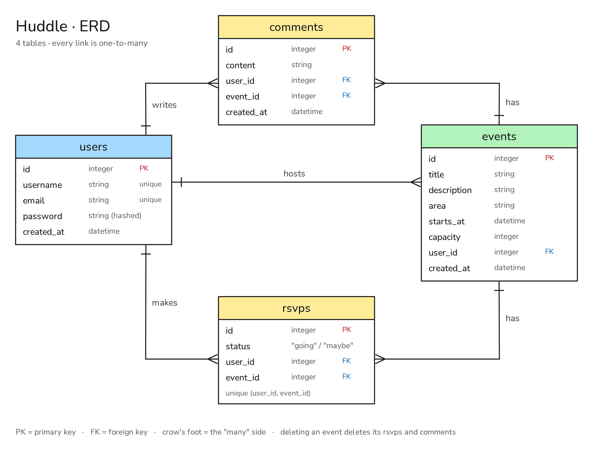
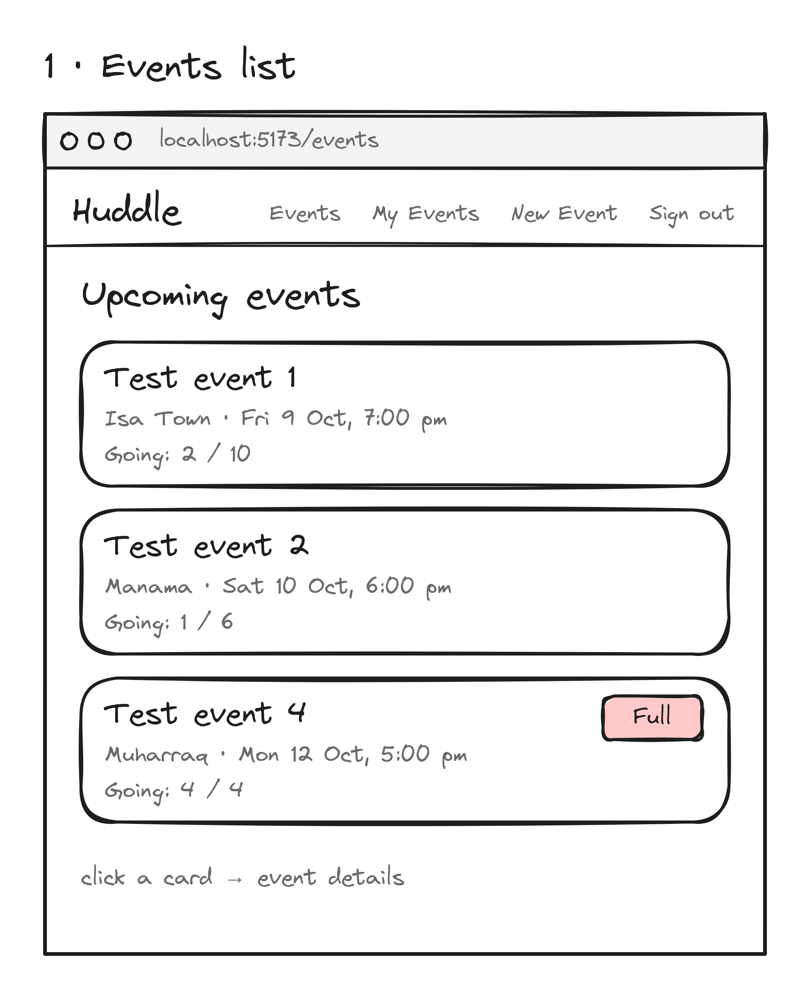
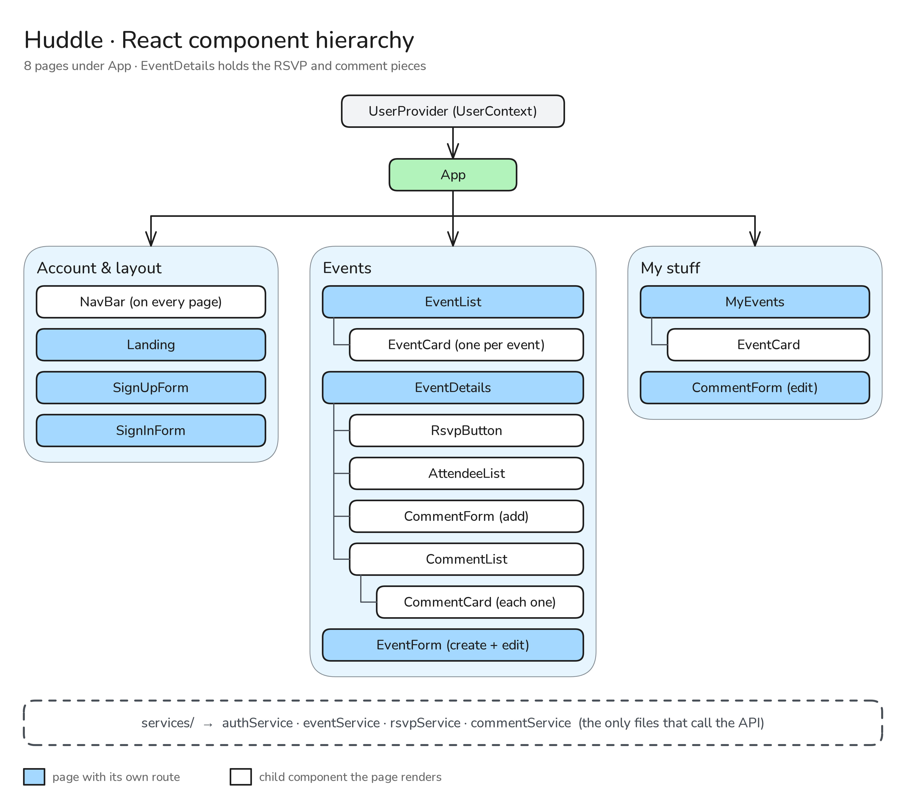

# Huddle API

Huddle is a local events board for Bahrain. Users can post events like a 5-a-side game, a study session or a board games night, RSVP as going or maybe, and chat in the comments. Events have a capacity, so once they're full no one else can RSVP as going.

This repo is the back end. The front end lives here: [huddle-frontend](https://github.com/IDAC1899/huddle-frontend)

## Technologies Used

- Python 3.14
- FastAPI
- SQLAlchemy and PostgreSQL
- Alembic (migrations)
- Pydantic (serializers)
- PyJWT and passlib/bcrypt (auth)
- Pytest

## ERD



- A user hosts many events, makes many RSVPs and writes many comments
- An event has many RSVPs and many comments
- Deleting an event also deletes its RSVPs and comments

## Routes

All routes start with `/api`.

| Method | Route | Auth | What it does |
|---|---|---|---|
| POST | `/register` | - | Create an account |
| POST | `/login` | - | Log in and get a token |
| GET | `/current_user` | Logged in | Get the signed-in user |
| GET | `/events` | - | All events, soonest first |
| GET | `/events/{id}` | - | One event with its host, RSVPs and comments |
| POST | `/events` | Logged in | Host a new event |
| PUT | `/events/{id}` | Host only | Edit an event |
| DELETE | `/events/{id}` | Host only | Delete an event (and its RSVPs and comments) |
| GET | `/my-events` | Logged in | Events you're hosting and attending |
| POST | `/events/{id}/rsvps` | Logged in | RSVP as going or maybe |
| PUT | `/rsvps/{id}` | Owner only | Switch between going and maybe |
| DELETE | `/rsvps/{id}` | Owner only | Cancel an RSVP |
| GET | `/events/{id}/comments` | - | Comments on an event |
| GET | `/comments/{id}` | - | One comment |
| POST | `/events/{id}/comments` | Logged in | Comment on an event |
| PUT | `/comments/{id}` | Owner only | Edit a comment |
| DELETE | `/comments/{id}` | Owner only | Delete a comment |

### RSVP rules

- One RSVP per user per event (409 if you try again)
- You can't RSVP as going when the event is full (400)
- Switching from maybe to going checks capacity again
- RSVPing as maybe doesn't take a spot

## Planning

### Wireframes

**Events list**



**Event details**


**New / edit event**


**My events**


**Sign up / Sign in**


### Component Hierarchy



## Getting Started

1. Clone the repo and install packages:
```bash
   pipenv install --dev
```
2. Create the database:
```bash
   createdb huddle_db
```
3. Create a `.env` file in the root:
```
   DATABASE_URL=postgresql+psycopg2://<your-username>@localhost:5432/huddle_db
   JWT_SECRET=<a long random string>
   CORS_ORIGINS=http://localhost:5173,http://127.0.0.1:5173
```
4. Run the migrations and seed the data:
```bash
   pipenv run alembic upgrade head
   pipenv run python seed.py
```
5. Start the server:
```bash
   pipenv run uvicorn main:app --reload
```
6. Open http://127.0.0.1:8000/docs to try the routes. Seeded users all have the password `123` (`isa_aldaaysi`, `test1` to `test4`).

## Next Steps

- Event categories (sports, study, gaming) with filters
- Search events by area
- Waitlist when an event is full
- Event images